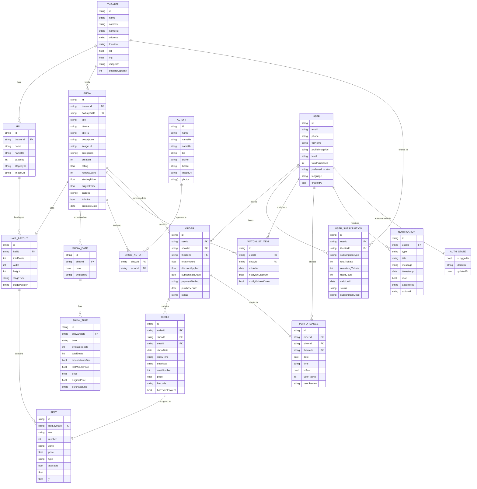

# ShowME App — Entity Relationship Diagram (v1)

## Legend

| Symbol | Meaning |
|--------|---------|
| `\|\|--\|\|` | One-to-one |
| `\|\|--o{` | One-to-many |
| `o{--o{` | Many-to-many |

## Notes
- **SHOW_ACTOR** is a junction table resolving the many-to-many between Show and Actor
- **AUTH_STATE** is stored locally (AsyncStorage), not on a server
- **HALL_LAYOUT** is denormalised slightly — a Hall has a fixed layout, but a Show can override which layout to use (e.g. thrust vs. proscenium for the same hall)
- **SHOW_TIME.purchaseLink** points to the theater's external ticketing site (no in-app checkout in v1)
- All text fields with `He`/`Ru` suffixes support Hebrew and Russian localisation
